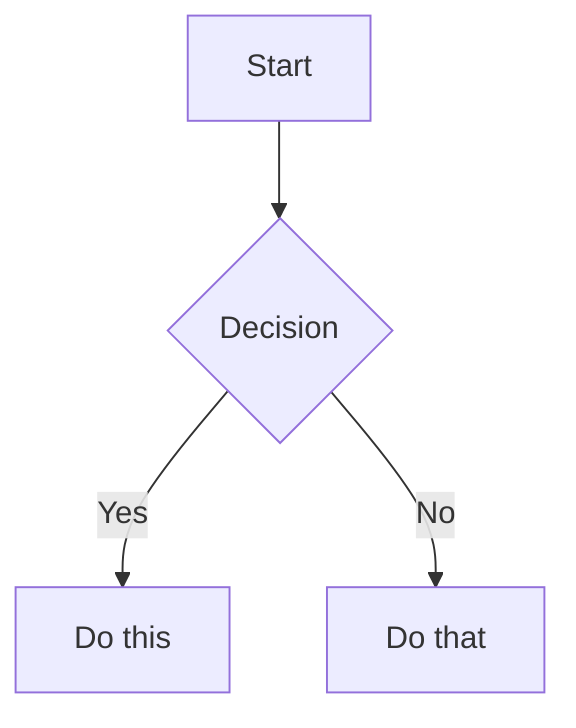

# Obsidian Flavored Markdown Skill

## Overview

Create and edit valid Obsidian Flavored Markdown (OFM) that also obeys the user's two personal formatting rules. OFM extends CommonMark and GFM with wikilinks, embeds, callouts, properties, comments, and other syntax; this skill covers those extensions and bakes the user's heading-depth and bullet-depth preferences into every note it produces. Standard Markdown (bold, italic, code blocks, tables) is assumed knowledge.

## When to Use

- Creating or editing any `.md` file that will live inside an Obsidian vault.
- The user asks for wikilinks, embeds, callouts, frontmatter, tags, comments, highlights, or Mermaid diagrams.
- The user writes in Korean and mentions "옵시디언 노트", "콜아웃", "프론트매터", "태그", "임베드".

**NOT for:**
- Plain GitHub or generic Markdown where OFM syntax would render as raw text.
- SKILL.md or other agent-facing meta-documentation -- those follow the agent-skills spec (which uses an H1 title) and are exempt from the note-formatting rules below.

## Workflow

1. **Add frontmatter** with properties (title, tags, aliases) at the top of the file. See [PROPERTIES.md](references/PROPERTIES.md) for all property types.
2. **Write content** using standard Markdown for structure, plus the OFM syntax below.
3. **Link related notes** using wikilinks (`[[Note]]`) for internal vault connections, and standard Markdown links for external URLs.
4. **Embed content** from other notes, images, or PDFs using `![[embed]]`. See [EMBEDS.md](references/EMBEDS.md).
5. **Add callouts** for highlighted information using `> [!type]`. See [CALLOUTS.md](references/CALLOUTS.md).
6. **Check formatting against the Formatting Rules below** -- no H1, no H5+, no bullet past depth 3. Fix before moving on.
7. **Verify** the note renders correctly in Obsidian's reading view.

> When choosing between wikilinks and Markdown links: use `[[wikilinks]]` for notes within the vault (Obsidian tracks renames automatically) and `[text](url)` for external URLs only.

## Formatting Rules

Apply to every note created or edited under this skill. These rules override whatever example headings or bullet depths appear in upstream OFM references.

### Rule 1: Headings `##` -- `####` only

Use only `##` (H2), `###` (H3), and `####` (H4). Never use `#` (H1) and never use `#####`/`######` (H5/H6).

- **Why no H1:** The note title lives in the filename and the frontmatter `title` property -- an H1 inside the body duplicates it and breaks outline renderers that treat the filename as the document title.
- **Why no H5+:** If a section needs to nest past H4, the section is doing too much -- split it into sibling H3s, promote it to its own note, or flatten the hierarchy.

```markdown
# Project Alpha            <- BAD: H1 duplicates the title

## Project Alpha           <- GOOD: top-level section is H2
### Tasks                  <- GOOD: H3 for subsection
#### Backend               <- GOOD: H4 is the deepest allowed
##### API routes           <- BAD: H5 -- restructure instead
```

### Rule 2: Nested bullets capped at depth 3

Top-level bullet counts as depth 1. A bullet indented once is depth 2. Indented twice is depth 3. A fourth level is not allowed -- promote it to a sub-heading, a separate list, or prose.

```markdown
- Phase one                 <- depth 1 (GOOD)
  - Backend                 <- depth 2 (GOOD)
    - Auth rewrite          <- depth 3 (GOOD, deepest allowed)
      - JWT rotation        <- depth 4 (BAD: flatten or promote)
```

Fix by promoting:

```markdown
- Phase one
  - Backend
    - Auth rewrite (see below)

### Auth rewrite details
- JWT rotation
- Session invalidation
```

## Internal Links (Wikilinks)

```markdown
[[Note Name]]                          Link to note
[[Note Name|Display Text]]             Custom display text
[[Note Name#Heading]]                  Link to heading
[[Note Name#^block-id]]                Link to block
[[#Heading in same note]]              Same-note heading link
```

Define a block ID by appending `^block-id` to any paragraph:

```markdown
This paragraph can be linked to. ^my-block-id
```

For lists and quotes, place the block ID on a separate line after the block:

```markdown
> A quote block

^quote-id
```

## Embeds

Prefix any wikilink with `!` to embed its content inline:

```markdown
![[Note Name]]                         Embed full note
![[Note Name#Heading]]                 Embed section
![[image.png]]                         Embed image
![[image.png|300]]                     Embed image with width
![[document.pdf#page=3]]               Embed PDF page
```

See [EMBEDS.md](references/EMBEDS.md) for audio, video, search embeds, and external images.

## Callouts

```markdown
> [!note]
> Basic callout.

> [!warning] Custom Title
> Callout with a custom title.

> [!faq]- Collapsed by default
> Foldable callout (- collapsed, + expanded).
```

Common types: `note`, `tip`, `warning`, `info`, `example`, `quote`, `bug`, `danger`, `success`, `failure`, `question`, `abstract`, `todo`.

See [CALLOUTS.md](references/CALLOUTS.md) for the full list with aliases, nesting, and custom CSS callouts.

## Properties (Frontmatter)

```yaml
---
title: My Note
date: 2024-01-15
tags:
  - project
  - active
aliases:
  - Alternative Name
cssclasses:
  - custom-class
---
```

Default properties: `tags` (searchable labels), `aliases` (alternative note names for link suggestions), `cssclasses` (CSS classes for styling). See [PROPERTIES.md](references/PROPERTIES.md) for all property types, tag syntax rules, and advanced usage.

## Tags

```markdown
#tag                    Inline tag
#nested/tag             Nested tag with hierarchy
```

Tags can contain letters, numbers (not first character), underscores, hyphens, and forward slashes. Tags can also be defined in frontmatter under the `tags` property.

## Comments

```markdown
This is visible %%but this is hidden%% text.

%%
This entire block is hidden in reading view.
%%
```

## Highlight

```markdown
==Highlighted text==
```

## Math (LaTeX)

```markdown
Inline: $e^{i\pi} + 1 = 0$

Block:
$$
\frac{a}{b} = c
$$
```

## Diagrams (Mermaid)

````markdown

````

To link Mermaid nodes to Obsidian notes, add `class NodeName internal-link;`.

## Footnotes

```markdown
Text with a footnote[^1].

[^1]: Footnote content.

Inline footnote.^[This is inline.]
```

## Complete Example

This example obeys both formatting rules: headings stay within `##`-`####`, and no bullet list reaches depth 4.

````markdown
---
title: Project Alpha
date: 2024-01-15
tags:
  - project
  - active
status: in-progress
---

## Summary

This project aims to [[improve workflow]] using modern techniques.

> [!important] Key Deadline
> The first milestone is due on ==January 30th==.

## Tasks

- [x] Initial planning
- [ ] Development phase
  - [ ] Backend implementation
  - [ ] Frontend design

### Backend

- Auth service
  - JWT rotation
  - Session store

### Frontend

- Component library
- Routing rewrite

## Notes

The algorithm uses $O(n \log n)$ sorting. See [[Algorithm Notes#Sorting]] for details.

![[Architecture Diagram.png|600]]

Reviewed in [[Meeting Notes 2024-01-10#Decisions]].
````

## Common Rationalizations

| Rationalization | Reality |
|---|---|
| "I'll use H1 for the title so it's obvious what the note is about." | The title lives in the filename and frontmatter `title` property. An H1 duplicates them and breaks outline renderers that already treat the filename as the document title. |
| "Just one more indent level -- the structure really is that deep." | Past depth 3 readers lose the outline. Promote the content to a sub-heading, a separate list, or prose. If the data truly has 4+ axes, it's a table, not a list. |
| "This note is a meta-doc, so H5/H6 is fine." | If the note needs H5, it needs to be split. Nothing in an Obsidian note renders better at H5 than it does as its own sibling H3/H4 section. |
| "The upstream kepano example used deeper nesting, so it's fine to copy." | Upstream is a syntax reference, not a style guide. These rules override any nesting shown in references. |

## Red Flags

- A leading `# ` line inside the body of an Obsidian note (H1).
- Any `##### ` or `###### ` line (H5/H6).
- A bullet indented four or more levels (typically 6+ leading spaces with 2-space indent, or 12+ with 4-space indent).
- Headings skipping levels (`##` directly into `####`) because the agent is trying to avoid H5 by jumping -- restructure instead.
- Frontmatter `title` plus an H1 restating the same string.

## Verification

- [ ] Frontmatter is present and at least one property is set.
- [ ] `grep -nE '^# ' <note>` returns zero matches (no H1 in body).
- [ ] `grep -nE '^#{5,} ' <note>` returns zero matches (no H5+).
- [ ] `grep -nE '^ {6,}- |^\t{3,}- ' <note>` returns zero matches for 2-space indentation (or `^ {12,}-` for 4-space).
- [ ] Every wikilink resolves to an existing note or is explicitly intended as a placeholder.
- [ ] Callouts use a valid type from [CALLOUTS.md](references/CALLOUTS.md).
- [ ] The note renders in Obsidian reading view without broken embeds or unrendered syntax.

## References

- [Obsidian Flavored Markdown](https://help.obsidian.md/obsidian-flavored-markdown)
- [Internal links](https://help.obsidian.md/links)
- [Embed files](https://help.obsidian.md/embeds)
- [Callouts](https://help.obsidian.md/callouts)
- [Properties](https://help.obsidian.md/properties)
