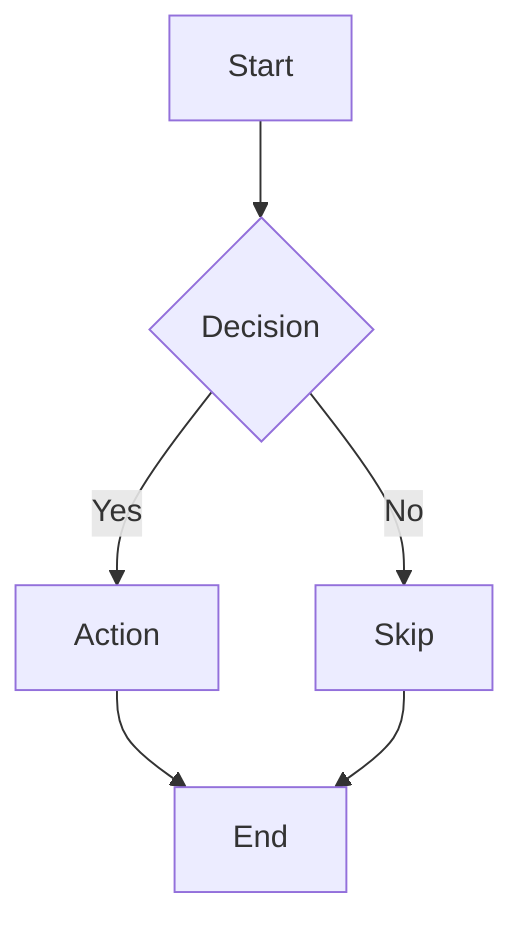

# Obsidian Mermaid

## Overview

Obsidian bundles Mermaid 11.4.1 (behind the current release). Diagrams from mermaid.live or AI tools often break because of `\n` in labels, unquoted special characters, subgraph direction, or post-11.4.1 diagram types. This skill encodes what actually works. See also `obsidian-mermaid.md` in this folder for the full reference.

## Key Constraints

| Rule | Detail |
| --- | --- |
| Use `flowchart`, not `graph` | Different rendering behavior in Obsidian despite being spec aliases |
| No `\n` in labels | Use `<br>` or keep labels single-line |
| Quote special characters | Wrap labels containing `()`, `:`, `/`, or non-ASCII in `”quotes”` |
| `direction` in subgraphs ignored | Silently ignored when nodes have external edges |
| `%%{init}%%` not supported | Config blocks are not rendered |
| Max ~5 nodes per diagram | Beyond this, readability collapses |
| Prefer TD or LR orientation | Most readable for vault diagrams |

## Supported Diagram Types (11.4.1)

Works: `flowchart`, `sequenceDiagram`, `classDiagram`, `stateDiagram-v2`, `gantt`, `journey`, `mindmap`, `timeline`, `sankey`, `xychart-beta`

Does NOT work (post-11.4.1): `block-beta`, `architecture`, `kanban`

## Example: Safe Flowchart

````markdown

````

## When to Use

- Use when the output should be a Mermaid diagram inside an Obsidian note.
- Use when a diagram clarifies process, flow, architecture, or relationships.
- Do not use when the renderer is not Obsidian's bundled Mermaid.

## Process

1. **Pick the right diagram type**
	- Choose from the supported list above. Default to `flowchart TD` or `flowchart LR`.

2. **Write labels safely**
	- No `\n` — use `<br>` or single-line text.
	- Wrap any label with `()`, `:`, `/`, or non-ASCII in double quotes.

3. **Keep diagrams small**
	- Max ~5 nodes. Split into multiple diagrams if larger.
	- Prefer two clean diagrams over one dense one.

4. **Verify syntax**
	- Check code fence is ` ```mermaid ` (no extra characters).
	- Confirm diagram type is in the supported list.

## Common Rationalizations

| Rationalization | Reality |
| --- | --- |
| “If mermaid.live renders it, Obsidian will too.” | Obsidian is pinned to 11.4.1; newer features silently fail. |
| “I can put everything into one diagram.” | Diagrams beyond ~5 nodes become unreadable; split them. |
| “`\n` works in labels on the live editor.” | `\n` in labels breaks Obsidian's parser; use `<br>`. |

## Red Flags

- `graph` keyword used instead of `flowchart`.
- `\n` appears in any node label.
- `%%{init}%%` block present.
- Diagram uses `block-beta`, `architecture`, or `kanban` types.
- More than ~5 nodes without splitting into sub-diagrams.

## Verification

After applying this skill, confirm:

- [ ] Diagram type is from the supported list.
- [ ] No `\n` in labels — `<br>` or single-line only.
- [ ] Labels with `()`, `:`, `/`, or non-ASCII are quoted.
- [ ] Diagram has ~5 or fewer nodes, or is split.
- [ ] Code fence is correctly formed as ` ```mermaid `.
